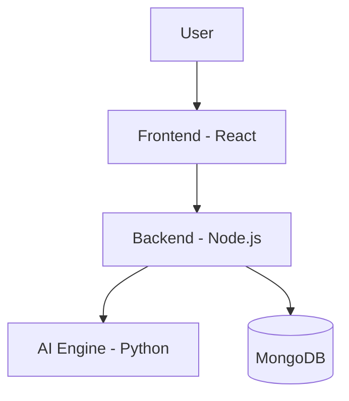

# 💼 JobMatchAI – Smart Resume Matcher with AI

**JobMatchAI** is an AI-powered job aggregator platform that intelligently matches candidate resumes with job descriptions using NLP techniques. Built with a full-stack architecture and powered by semantic similarity analysis, JobMatchAI is designed to simplify job discovery and improve recruiter relevance.

---

## 🚀 Features

- 📄 Upload or paste resumes and job descriptions
- 🧠 NLP-powered match scoring (spaCy / transformers)
- 📊 Confidence summary with result explanation
- 🔖 Bookmark job listings for later
- 🌐 Clean UI powered by React

---

## 🛠 Tech Stack

| Frontend     | Backend        | AI Engine       | Database |
|--------------|----------------|------------------|----------|
| React.js     | Node.js + Express | Python (spaCy, transformers) | MongoDB |

---

## 📁 Project Structure

JobMatchAI/ 
├── client/ # Frontend (React) 
├── server/ # Backend API (Express) 
├── ai-engine/ # AI Matching Engine (Python) 
├── README.md 
├── .gitignore


---

## 🧠 Architecture



# 📦 Installation

 # 1. Clone the repo
git clone https://github.com/Shivanshupandey5/JobMatchAI

# 2. Setup client
cd client
npm install
npm start

# 3. Setup server
cd ../server
npm install
node index.js

# 4. Setup AI Engine
cd ../ai-engine
python -m venv venv
source venv/bin/activate
pip install -r requirements.txt
python matcher_wrapper.py


# 🧪Example Input & Output

Resume: "Developer with strong skills in React and Node.js."
Job Description: "Looking for full-stack engineer with React and backend knowledge."
Output: {
  "match_score": 55.17,
  "summary": "Resume matches the job description with 55.17% confidence."
}


# 🔮 Future Scope
🔍 Resume PDF parsing with OCR

📑 LinkedIn Job scraping

🎯 Vector-based semantic search (using OpenAI or Cohere)

📊 Dashboard for visual analytics


# 👨‍💻 Developed by

**Shivanshu Pandey**
B.Tech CSE | AI Enthusiast | Full-Stack Developer
🔗 LinkedIn
🛠 GitHub: @shivanshupandey5


---

### ✅ 2. `.gitignore` File (Ensure It Includes):

```txt
node_modules/
.env
.DS_Store
*.log
*.pyc
__pycache__/
venv/


