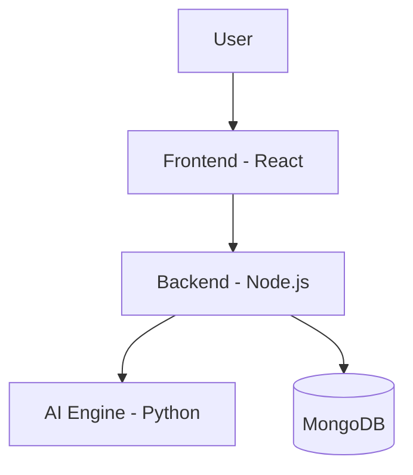

# 💼 JobMatchAI – Smart Resume Matcher with AI

**JobMatchAI** is an intelligent platform that matches candidate resumes with job descriptions using NLP and semantic analysis. It aims to simplify job discovery for applicants and improve relevance for recruiters.

## 🚀 Features

- 📄 Upload or paste resume and job description
- 🧠 AI Engine powered by NLP & semantic similarity
- 📊 Get a match score + human-readable summary
- 🌐 Built with full-stack: React + Node + Python

## 🛠 Tech Stack

| Frontend     | Backend        | AI Engine       | Database |
|--------------|----------------|------------------|----------|
| React.js     | Node.js, Express | Python, spaCy, transformers | MongoDB |

## 🧠 Architecture

📦 Installation
 # 1. Clone the repo
git clone https://github.com/Shivanshupandey5/JobMatchAI

# 2. Setup client
cd client
npm install
npm start

# 3. Setup server
cd ../server
npm install
node index.js

# 4. Setup AI Engine
cd ../ai-engine
python -m venv venv
source venv/bin/activate
pip install -r requirements.txt
python matcher_wrapper.py

🧪 #Example Input & Output
Resume: "Developer with strong skills in React and Node.js."
Job Description: "Looking for full-stack engineer with React and backend knowledge."
Output: {
  "match_score": 55.17,
  "summary": "Resume matches the job description with 55.17% confidence."
}

📌 #Future Scope
🔍 Resume parsing from PDF

🎯 Improved vector-based matching

📑 Support for LinkedIn job scraping

📈 Analytics dashboard

📁 #Folder Structure
JobMatchAI/
├── client/         # React frontend
├── server/         # Node backend API
├── ai-engine/      # Python AI scripts
├── README.md

👨‍💻 #Developed by
Shivanshu Pandey

💼 Full Stack + AI Dev

🔗 LinkedIn

🧠 Currently building this for IIT/Google outreach + learning
